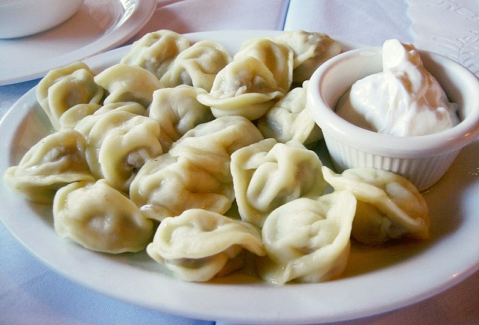

 
  

# Pelmeni

### Sadece Kitap Arşivim

## 📃 Önsöz

Merhabalar! 

Öncelikle şunu belirtmeliyim ki proje ismi *-"Pelmeni"-* konuyla tamamen alakasız. Aslında aklıma gelen ilk şey buydu desek yalan olmaz. Pelmeni aslında bir Rus mantısı.. *[Meraklısına Detaylar](Main/Harem/Pelmeni.md)*

Her neyse, bu projeyi yapmamın arkasında birçok neden yatıyor.. Ama en önemlisi insanlara ***Dostoyevski sevgisi kazandırmak*** olabilir.. Diğer büyük neden ise aynı içeriğe sahip Reddit Gönderimin silinmesine dayanıyor. Meraklısına [Detaylı Önsöz](Main/Harem/Preface.md)

## 🧱 Bütünlük

> [!CAUTION] 
> Bağlantılar çalışmıyor.

## ⬇️ İndir

Yayınları *Sıkıştırılmış Dosya Formatında(ZIP)* indirebilirsiniz. Bu dosyayı çıkartmak ve okumak için bazı uygulamalara başvurmanız gerekebilir. Ne dediğimi anlamıyorsanız [Araçlar için makaleye](Main/Harem/Tools.md) bakınız.
 

- ***Arşivi indirmek için [Tüm Yayınlara](Main/Content.md) göz at.***
  
- ~~Arşivi **[Telegram](Main/Messages/mal.md)** üzerinden indir.~~ (Şuanlık Yok)

## 🐰 Planlama

- [ ] Yayınları tamamla
    - [x] İş Bankası Yayınları
        - [x] Hasan Ali Yücel Dizisi
        - [x] Modern Klasikler Dizisi
        - [ ] Biyografiler Dizisi
        - [ ] Nehir Söyleşi Dizisi
        - [ ] Türk Edebiyatı Klasikleri
    - [x] Yapı Kredi Yayınları 
    - [ ] Can Yayınları
    - [ ] İthaki Yayınları
    - [ ] April Yayınları
    - [ ] Doğan Kitap Yayınları
    - [ ] İletişim Yayınları
    - [ ] Sel Yayınları
    - [ ] Remzi Kitabevi
    - [ ] Alfa Yayınları
    - [ ] Metis Yayınları
    - [ ] Kırmızı Kedi Yayınevi

## 🌹 Teşekkürler

Reddit sayesinde **Markdown** kullanmaya biraz aşinayım. Tabiki buradaki biraz daha detaylı olsa gerek - Alışmam biraz zor gözüktü. Fakat bana yardım edenler sayesinde aslında korktuğum şeyin ne kadar basit olduğunu görmüş oldum.. Bu süreçte başta **Kayra Özbek** ve diğer kişiler adına teşekkürlerimi sunarım. Minnettarım 💜

